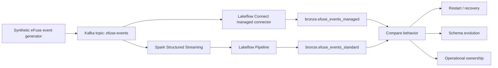

# Learning architecture

```mermaid
flowchart LR
    G[Synthetic eFuse event generator] --> K[Kafka topic: efuse-events]

    K --> M[Lakeflow Connect managed connector]
    M --> BM[bronze.efuse_events_managed]

    K --> S[Spark Structured Streaming]
    S --> P[Lakeflow Pipeline]
    P --> BS[bronze.efuse_events_standard]

    BM --> C[Compare behavior]
    BS --> C

    C --> R[Restart / recovery]
    C --> E[Schema evolution]
    C --> O[Operational ownership]
```

Both paths must ingest the same logical event so that differences are attributable to the ingestion approach rather than the data.
