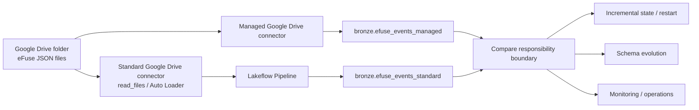

# Learning architecture

The first comparison uses the **same Google Drive folder** on both paths.

The source data stays constant. The main variable is the ingestion abstraction.

Kafka is retained later as an advanced streaming-specific experiment.
